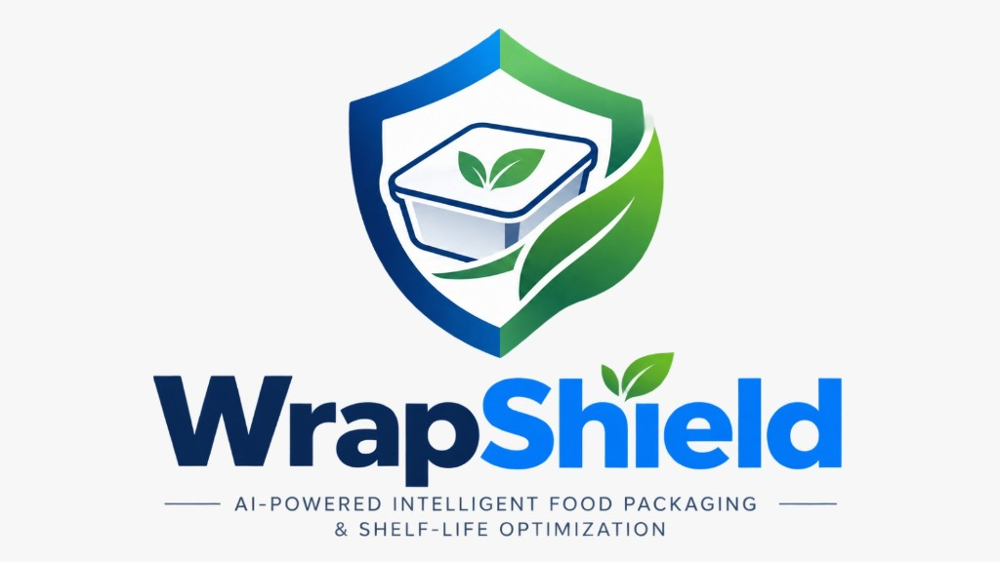
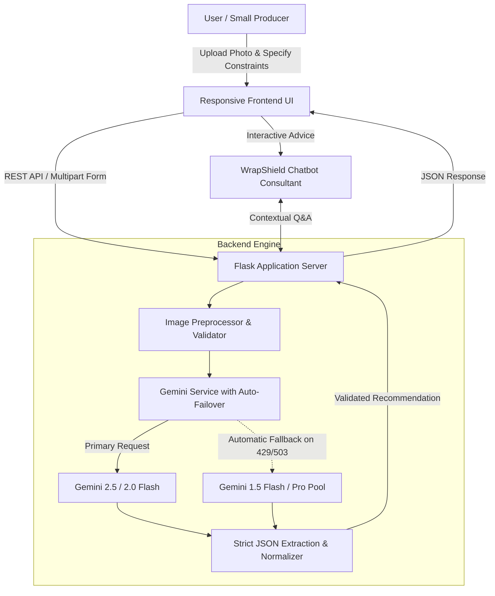

<div align="center">



# WrapShield AI (PackSmart AI)

### 🛡️ Smart, Multimodal Food Packaging Recommendation & Advisory Engine

[](https://www.sih.gov.in/)
[](https://www.python.org/)
[](https://flask.palletsprojects.com/)
[](https://aistudio.google.com/)
[](LICENSE)

_Empowering rural farmers, artisanal food producers, SHGs, and small food enterprises with accessible, science-backed packaging intelligence._

---

[Key Features](#-key-features) • [System Architecture](#-system-architecture) • [Getting Started](#-getting-started) • [API Reference](#-api-reference) • [Tech Stack](#-tech-stack) • [Team](#-team-elitearrows)

</div>

---

## 📌 Problem Overview

Small-scale food producers, rural farming cooperatives, and home-based food businesses face significant financial losses due to **spoilage, moisture ingress, oxidation, and packaging failures**. Most producers cannot afford dedicated food-technology consultants or navigate complicated technical polymer terminology (such as _BOPP, EVOH, WVTR, OTR_).

**WrapShield AI** bridges this gap by translating complex food-preservation science into clear, actionable, and cost-effective packaging solutions using Google's multimodal **Gemini AI**.

---

## ✨ Key Features

- **📸 Multimodal Food Recognition**: Upload a photo of the food item or enter its name — the system automatically identifies the product and its shelf-life vulnerabilities.
- **📦 Comprehensive Packaging Recommendations**:
  - **Material & Structure Breakdown**: Visual descriptions with trade names (e.g., Kraft paper + Met-PET barrier) and layer-by-layer structure (outer strength, core barrier, food-contact heat seal).
  - **Barrier Protection Matrix**: High / Medium / Low ratings for **Moisture**, **Oxygen**, and **Light** vulnerability.
  - **Scientific Spoilage Context**: Explains exactly _why_ the food spoils and how the packaging prevents degradation.
- **💰 Budget & Sustainable Alternatives**:
  - **Low-Cost Wholesale Option**: Readily accessible materials for tight budgets and local markets.
  - **Eco-Friendly Alternative**: 100% recyclable (Mono-PE) or compostable/biodegradable options.
- **🤖 Built-in AI Packaging Consultant**: An interactive chatbot providing contextual advice on sealing machines, storage temperatures, supplier sourcing, and cost reductions.
- **⚡ Resilient Multi-Model Failover**: Intelligent failover pool (`gemini-2.5-flash`, `gemini-2.0-flash`, `gemini-1.5-flash`, `gemini-1.5-pro`) to ensure 99.9% uptime during rate-limits or high server load.
- **🎨 Intuitive & Accessible UI**: Clean, responsive web dashboard with drag-and-drop file upload, instant image previews, and real-time backend health monitoring.

---

## 🏛️ System Architecture



---

## 📁 Repository Structure

```text
packsmart-ai/
├── backend/
│   ├── app.py                 # Flask REST API endpoints & static server
│   ├── gemini_service.py      # Multimodal Gemini engine & multi-model fallback pool
│   ├── requirements.txt       # Python dependencies
│   ├── .env.example           # Environment template
│   └── .env                   # Local secrets (API keys)
├── frontend/
│   ├── index.html             # Dashboard markup & interactive layout
│   ├── style.css              # Custom responsive stylesheet & animations
│   ├── script.js              # Client-side validation, API calls & chat logic
│   └── wrapshield-logo.jpg    # Branding asset
├── testimages/                # Sample test images for demonstration
└── README.md                  # Project documentation
```

---

## 🚀 Getting Started

Follow these steps to set up and run WrapShield AI locally.

### Prerequisites

- **Python 3.10+** installed
- **Google Gemini API Key** (Free tier available at [Google AI Studio](https://aistudio.google.com/))
- Git

### 1. Clone the Repository

```bash
git clone https://github.com/Vinit-1205/SIH-Team-EliteArrows.git
cd SIH-Team-EliteArrows/packsmart-ai
```

### 2. Set Up the Backend

```bash
# Navigate to backend directory
cd backend

# Create a virtual environment (optional but recommended)
python -m venv venv

# Activate the virtual environment
# On Windows:
venv\Scripts\activate
# On Linux/macOS:
source venv/bin/activate

# Install dependencies
pip install -r requirements.txt
```

### 3. Configure Environment Variables

Create a `.env` file inside the `backend/` folder:

```bash
cp .env.example .env
```

Open `.env` and add your Gemini API Key:

```env
GEMINI_API_KEY=your_actual_gemini_api_key_here
FLASK_PORT=5000
FLASK_DEBUG=True
```

### 4. Run the Application

Start the Flask server:

```bash
python app.py
```

The application will be live at:

- **Web Interface:** [http://127.0.0.1:5000/](http://127.0.0.1:5000/)
- **Health Check:** [http://127.0.0.1:5000/api/health](http://127.0.0.1:5000/api/health)

---

## 🔌 API Reference

### 1. Health Check

`GET /api/health`
Checks server status and whether Gemini API key is configured.

**Response:**

```json
{
  "status": "ok",
  "service": "WrapShield AI Backend",
  "gemini_api_configured": true,
  "mode": "Live Gemini API"
}
```

### 2. Analyze Food Packaging

`POST /api/analyze`
Accepts `multipart/form-data` with product information and optional photo.

**Form Parameters:**
| Parameter | Type | Required | Description |
| :--- | :--- | :--- | :--- |
| `image` | File | Optional* | Food product photo (PNG, JPG, WEBP, max 5MB) |
| `food_name` | Text | Optional* | Product title or brief description |
| `shelf_life` | Text | Optional | Target shelf life (e.g., `6 months`) |
| `storage_condition` | Text | Optional | Ambient / Refrigerated / Frozen / Humid |
| `transport_condition`| Text | Optional | Courier, local distribution, export |
| `budget_priority` | Text | Optional | Economy, Balanced, Premium |

_\* At least one of `food_name` or `image` must be supplied._

### 3. Interactive Packaging Chat

`POST /api/chat`
Ask questions regarding recommendations, equipment, or preservation.

**Request Payload:**

```json
{
  "message": "What sealing machine should I buy for this foil pouch?",
  "current_food_details": { "identified_food": "Potato Chips" },
  "messages": []
}
```

---

## 🛠️ Tech Stack

| Domain            | Technology                             | Purpose                                                      |
| :---------------- | :------------------------------------- | :----------------------------------------------------------- |
| **Backend**       | Python 3, Flask, Flask-CORS            | Lightweight REST API server & routing                        |
| **Generative AI** | Google Gemini (2.5-Flash, 2.0-Flash)   | Multimodal visual recognition & recommendation synthesis     |
| **Resilience**    | Custom Multi-Model Fallback Pool       | High-availability fallback handling rate limits & 503 errors |
| **Frontend**      | Vanilla HTML5, CSS3, JavaScript (ES6+) | Blazing fast, zero-dependency responsive client dashboard    |
| **Design & UX**   | Custom Card Design, Micro-Interactions | Simple, accessible interface for non-technical users         |

---

## 👥 Team EliteArrows

Developed for **Smart India Hackathon (SIH)**.

- Team EliteArrows Members & Contributors

---

## 📄 License

This project is licensed under the **MIT License** — feel free to modify and adapt it for agricultural and industrial applications.
